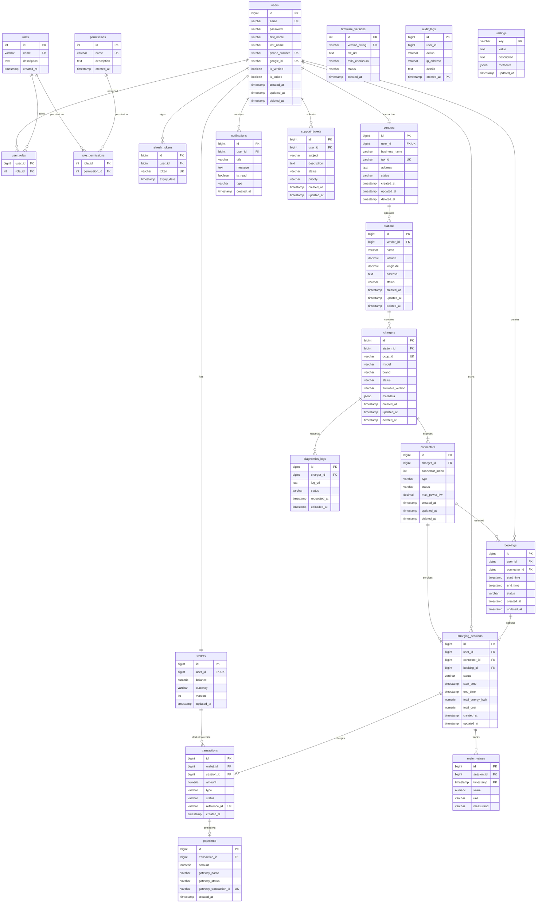

# EcoMargin Database Design & Architecture

This document describes the schema design, relationships, and performance optimization strategies for the EcoMargin enterprise EV charging platform database.

---

## 1. Entity Relationship (ER) Diagram

Below is the visual database representation including relations, join tables, and partitioning structures.



---

## 2. Table-by-Table Schema Specification

### 2.1 RBAC & User Management
* **`permissions`**: Defines standard granular platform operations (e.g. `READ_STATIONS`, `MANAGE_FIRMWARE`).
* **`roles`**: Contains logical roles (`ROLE_CUSTOMER`, `ROLE_VENDOR`, `ROLE_ADMIN`).
* **`role_permissions`**: Many-to-many join table mapping permissions to roles.
* **`users`**: Platform actors (drivers, vendor admins, global operators).
* **`user_roles`**: Many-to-many join table mapping users to roles.
* **`refresh_tokens`**: Stores OAuth2/JWT refresh tokens linked to a user.

### 2.2 Billing & Ledger
* **`wallets`**: Balances for drivers or vendors. Implements optimistic locking versioning.
* **`transactions`**: High-security double-entry style financial logs.
* **`payments`**: Records of external payment processor attempts (Stripe, PayPal, etc.).

### 2.3 Asset Management (CPO Assets)
* **`vendors`**: Businesses operating charging networks.
* **`stations`**: Charging station properties (containing multiple chargers, geolocation point data).
* **`chargers`**: Charging pillars communicating via OCPP (containing unique `ocpp_id`).
* **`connectors`**: Individual charging nozzles with specific plugs (CCS2, Type 2, GB/T).

### 2.4 Session Operations
* **`bookings`**: Connector reservation schedule records.
* **`charging_sessions`**: Main record mapping a customer's usage of a connector from plug-in to unplug.
* **`meter_values`**: High-volume sensor readings (voltage, power, active energy) transmitted by chargers every 10-30 seconds.

### 2.5 Utilities & Support
* **`notifications`**: Platform messages, promotional alerts, or transactional receipts for users.
* **`support_tickets`**: Customers logging issues for station operators or customer support.
* **`settings`**: Extensible key-value configs for platform properties (fees, default rates, timers).
* **`firmware_versions`**: Charger binary payloads for OTA firmware updates.
* **`diagnostics_logs`**: Requests and upload receipts of local charger logs.
* **`audit_logs`**: System audit log to track user activity (logins, config changes, administrative operations).

---

## 3. Enterprise Optimizations for High Scale

### 3.1 Soft Deletes
Instead of purging rows from core tables, columns `deleted_at TIMESTAMP WITH TIME ZONE` are added to master tables (`users`, `vendors`, `stations`, `chargers`, and `connectors`).
* All foreign key actions (like `ON DELETE CASCADE`) are replaced or guarded to ensure historical transactions (bookings, transactions, payments, charging sessions) remain preserved for financial reporting and auditing.
* Unique indexes are modified to be partial (e.g., `UNIQUE (ocpp_id) WHERE deleted_at IS NULL`), preventing name collisions with archived records.

### 3.2 Partitioning (High-Volume Tables)
We use PostgreSQL's native declarative range partitioning to handle high write rates and query scaling.
* **`meter_values`**: Partitioned by month (`PARTITION BY RANGE (timestamp)`).
* **`audit_logs`**: Partitioned by year (`PARTITION BY RANGE (created_at)`).
* **Benefits**:
  * **Partition Pruning**: Queries matching specific date brackets immediately ignore irrelevant partitions, bypassing billions of rows.
  * **Bulk Dropping**: Older logs/meter values can be deleted in milliseconds by dropping the partition table rather than running highly taxing `DELETE FROM` statements.

### 3.3 Wallet Concurrency & Ledger Integrity
To prevent race conditions during concurrent wallet balance adjustments (such as simultaneous station check-in charges and refund payouts):
1. **Optimistic Locking (`version` column)**:
   The `wallets` table includes a `version INT DEFAULT 0 NOT NULL` column. Hibernate utilizes this column with `@Version` annotations. Any modification is guarded by:
   ```sql
   UPDATE wallets SET balance = :new_balance, version = version + 1 WHERE id = :id AND version = :current_version;
   ```
   If another transaction update completed in between, a `StripeOptimisticLockingException` is thrown, prompting a safe retry.
2. **Pessimistic Locking Fallback**:
   For session starts, a `SELECT FOR UPDATE` block is executed on the driver's wallet to temporarily block concurrent adjustments until authorization resolves.

### 3.4 Spatial Indexing
For EV applications, locating nearby stations is a critical query.
* A composite index on `(latitude, longitude)` acts as a clean database-agnostic solution.
* For enterprise PostgreSQL, we recommend enabling `postgis` extension and migrating `latitude` and `longitude` fields to a PostGIS `GEOGRAPHY(Point, 4326)` column:
  ```sql
  CREATE INDEX idx_stations_geom ON stations USING gist(geography_column);
  ```
  This optimizes radial geo-distance queries by orders of magnitude compared to traditional bounding box calculations.

### 3.5 Partial & Composite Indexes
We employ strategic index layout to support complex query conditions:
* **Active Session Lookup**:
  ```sql
  CREATE INDEX idx_charging_sessions_active ON charging_sessions (connector_id, status)
  WHERE status IN ('STARTING', 'ACTIVE', 'STOPPING');
  ```
* **Active Reservation Validation**:
  ```sql
  CREATE INDEX idx_bookings_active ON bookings (connector_id, status, start_time, end_time)
  WHERE status IN ('PENDING', 'CONFIRMED');
  ```
* **Unread Notifications Lookup**:
  ```sql
  CREATE INDEX idx_notifications_user_unread ON notifications (user_id) WHERE is_read = FALSE;
  ```
* **Soft Delete Safe Indexes**:
  ```sql
  CREATE INDEX idx_chargers_active ON chargers (station_id) WHERE deleted_at IS NULL;
  ```
